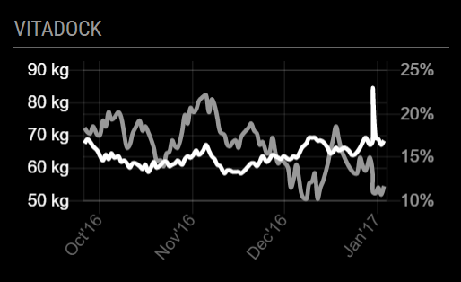

# Vitadock - MagicMirror² module

[](https://travis-ci.org/qistoph/MMM-vitadock)

This is a module for [MagicMirror²](https://github.com/MichMich/MagicMirror).
It aqcuires your TargetScale statistics from Vitadock and displays a graph of
your weight and fat percentage.



## Installing the module

To install the module, clone this repository to your __modules__ folder:
`git clone https://github.com/qistoph/MMM-vitadock.git vitadock`.
Then run `cd vitadock` and `npm install` to install the dependencies.

You will be guided to set-up the authorization for the app with your Vitadock.

## Using the module

To use this module, add it to the modules array in the `config/config.js` file:

```javascript
modules: [
  {
    module: 'vitadock',
    position: 'top_right',
    header: 'Weight/Fat',
    config: {
      credentials: {
        deviceToken: 'REPLACE WITH YOUR CREDENTIALS',
        deviceSecret: 'REPLACE WITH YOUR CREDENTIALS',
        oauthToken: 'REPLACE WITH YOUR CREDENTIALS',
        oauthTokenSecret: 'REPLACE WITH YOUR CREDENTIALS'
      }
    }
  }
]
```

## Configuration options

Currently the module does not have additional configuration options.
